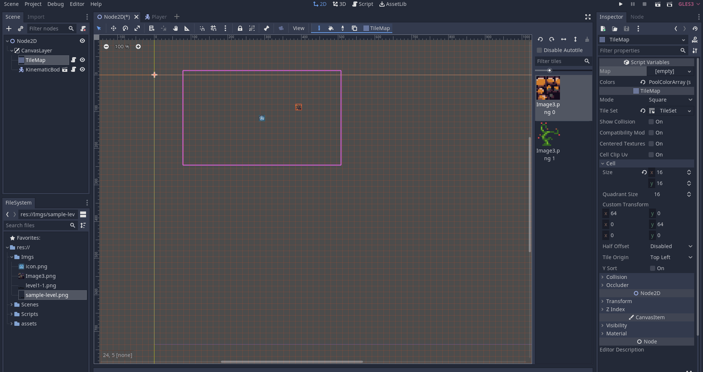
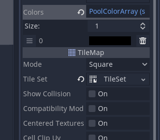
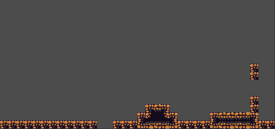
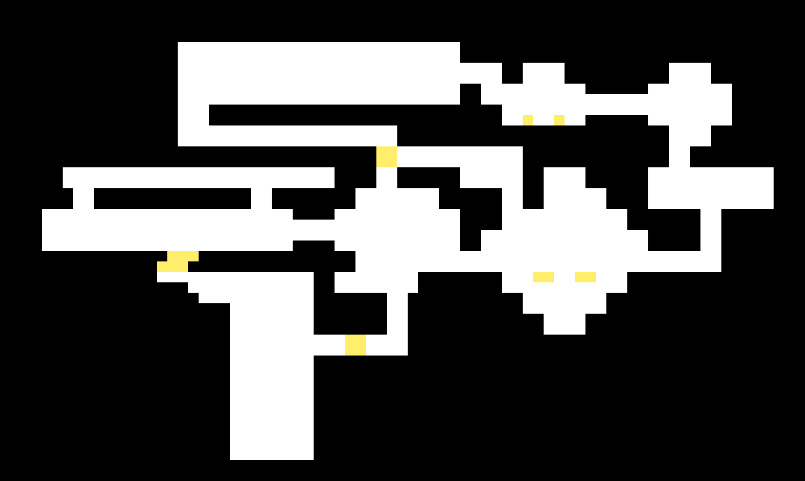

# PNG to TileMap - Godot Script

Godot Script that turns pixel sized images into tilemaps, inspired by this [Tutorial](https://youtu.be/B_Xp9pt8nRY) from Brackeys.

This Script uses the Tilemap Node functionalities, so it gets the PNG data and run each pixel and inserts the tile index according to the color asigned.

***

## How to Use It:

1. Draw your level on your favorite image editor
   

2. Drag and drop your map on the `Map` Texture field

3. On the `Colors` field you can increase the array value and set the color code according to your map.

4. The script will link the tilemap index with the colors index

## Result

